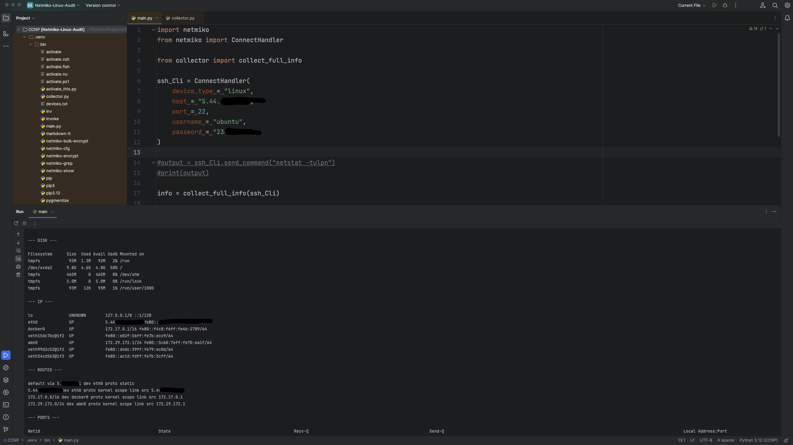
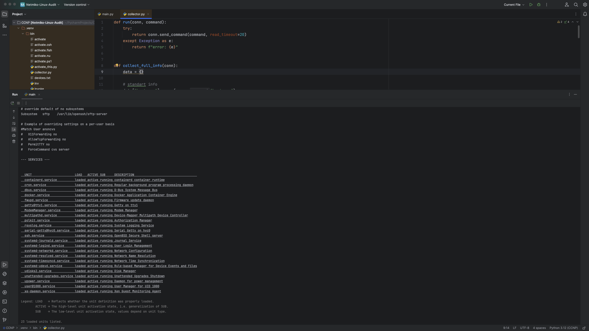

# 🚀 Linux Infrastructure Audit Tool


---

## 📌 Overview

This project is a lightweight **Linux audit tool** built with Python and Netmiko.

It connects to a Linux host over SSH and automatically collects detailed system information, helping engineers quickly understand the state of a server.

---

## ⚙️ What the Tool Does

The script executes multiple Linux commands remotely and gathers:

## 📸 Screenshot





### 🖥 System Information

* Hostname
* OS version (`/etc/os-release`)
* Kernel version
* Uptime

### 💾 Resources

* Memory usage (`free -m`)
* Disk usage (`df -h`)

### 🌐 Network

* IP addresses
* Routing table
* Open/listening ports

### 👤 Users

* Active users (`who`)
* Recent logins (`last`)

### 🔐 Security

* Sudo users
* SSH configuration

### ⚙️ Services

* Running system services

### 🐳 Docker

* Running containers

### 📦 Packages

* Installed packages (top 20)

### 📜 Logs

* Recent system errors (`journalctl`)

---

## 🧠 How It Works

The tool uses a simple execution wrapper:

```python
def run(conn, command):
    try:
        return conn.send_command(command, read_timeout=20)
    except Exception as e:
        return f"error: {e}"
```

Then collects all data in one function:

```python
def collect_full_info(conn):
    data = {}

    data["hostname"] = run(conn, "hostname")
    data["os"] = run(conn, "cat /etc/os-release")
    data["kernel"] = run(conn, "uname -a")
    data["uptime"] = run(conn, "uptime")

    data["memory"] = run(conn, "free -m")
    data["disk"] = run(conn, "df -h")

    data["ip"] = run(conn, "ip -brief a")
    data["routes"] = run(conn, "ip r")
    data["ports"] = run(conn, "ss -tulpn")

    data["who"] = run(conn, "who")
    data["last_logins"] = run(conn, "last -n 5")

    data["sudo_users"] = run(conn, "getent group sudo")
    data["ssh_config"] = run(conn, "cat /etc/ssh/sshd_config")

    data["services"] = run(conn, "systemctl list-units --type=service --state=running")

    data["docker"] = run(conn, "docker ps")

    data["packages"] = run(conn, "dpkg -l | head -n 20")

    data["errors"] = run(conn, "journalctl -p err -n 20")

    return data
```

---

## 🖼 Example Output

```bash
=== FULL INFO ===

--- HOSTNAME ---
ubuntu-server

--- MEMORY ---
total        used        free
...

--- DISK ---
Filesystem      Size  Used Avail Use%
...

--- PORTS ---
tcp   LISTEN ...
```

---

## 📂 Project Structure

```
project/
├── main.py
└── collector.py
```

---

## ⚙️ Installation

```bash
pip install netmiko
```

---

## ▶️ Usage

Edit connection settings in `main.py`:

```python
ssh_Cli = ConnectHandler(
    device_type="linux",
    host="YOUR_IP",
    port=22,
    username="YOUR_USERNAME",
    password="YOUR_PASSWORD",
)
```

Run:

```bash
python main.py
```


## 🚀 Future Improvements

* JSON / CSV export
* Multi-host support (inventory)
* Threshold-based alerts (CPU / RAM / Disk)
* Logging system
* CLI arguments
* Better parsing (structured output)

---

## 👨‍💻 Author

This project demonstrates practical skills in:

* Python automation
* SSH (Netmiko)
* Linux administration
* Infrastructure auditing

---
